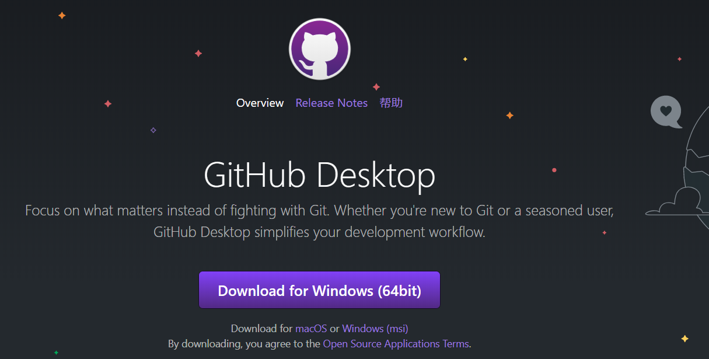
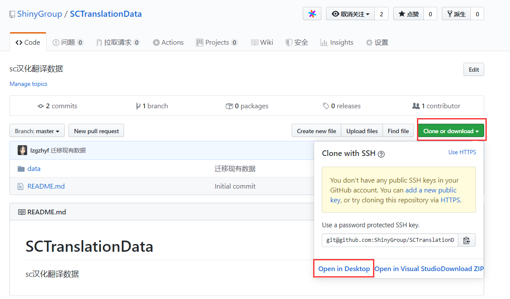
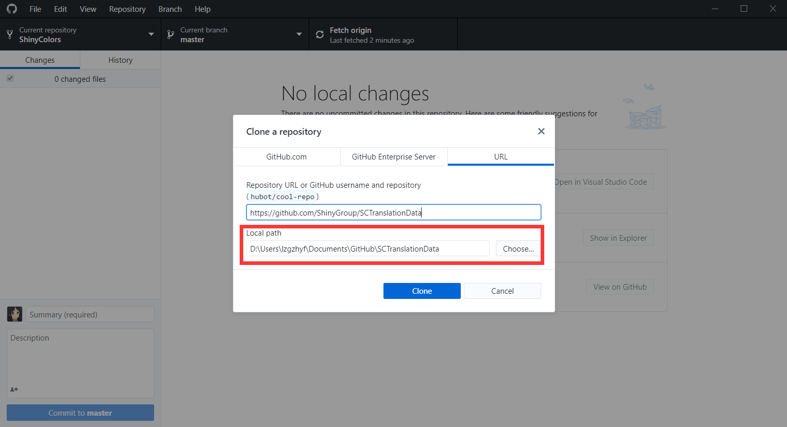
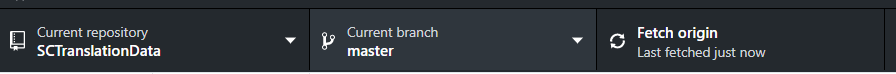
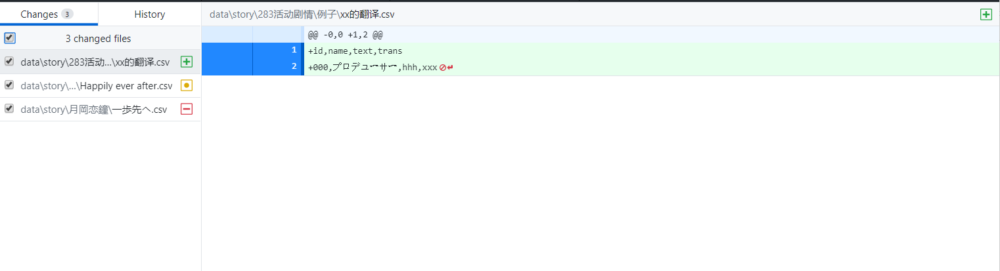
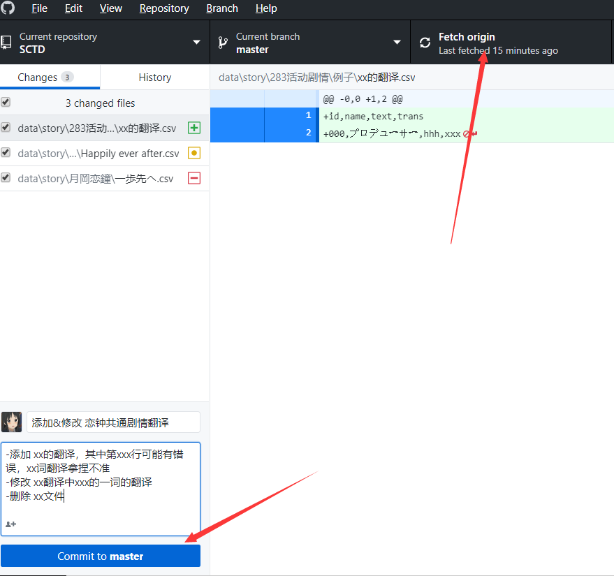
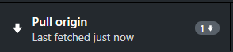
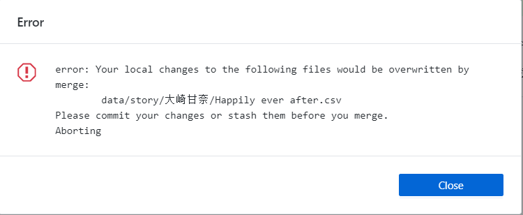
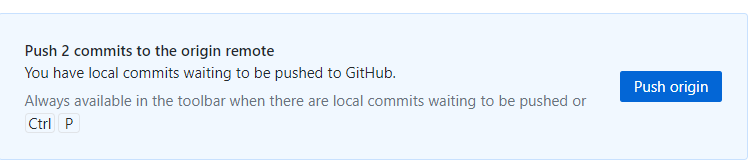

# GitHub客户端使用流程

## 1. 下载并安装[GitHub客户端](https://desktop.github.com/)

## 2. 打开客户端并登陆GitHub账号

## 3. 克隆远程仓库到本地

在本仓库下选择【Clone or download】-【Open in Desktop】

之后会自动打开GitHub客户端并弹出以上提示，图中红框为仓库保存的本地位置，可以自行更改，但必须记住！

## 4. 检查仓库状态

**为请确保同步，每次提交更改前都建议手动点一次【Fetch Origin】检查远程仓库是否有更新**

仓库克隆完毕后，请确保上方的状态栏和图中一样。

第一栏【Current repository】表示当前操作的仓库名称

第二栏【Current branch】表示当前操作的分支，本项目中也不需要变更，全部翻译都提交到master分支

第三栏【Fetch Origin】表示同步情况，一般客户端会定时读取。

## 5. 动手翻译

现在你可以打开本地的仓库文件夹进行新建、修改、删除，和操作本地文件是一样的。

详情见[翻译流程](翻译流程.md)和[翻译格式和规范](翻译格式和规范.md)

## 6. 确认文件修改

当你完成翻译之后，回到GitHub客户端，你会发现你所做的修改在左侧状态栏全部列出，并且右侧会显示每个文件详细的更改。

绿色[+]符号表示你新建的文件

黄色[·]符号表示你修改的文件

红色[-]符号表示你删除的文件

**请在提交修改之前确认你所做的所有更改，左边的[√]选中则代表此项修改将被包含在提交中**

**另外，本地文件夹内==不要直接重命名==<u>已提交</u>的文件或文件夹！！！**

> 除非你熟练git mv命令

## 7. 提交修改

确认完毕后，请点击【Fetch Origin】，先同步最新文件

如果远程仓库没有更新，那么你就可以在左下角写上本次的提交信息，然后直接【Commit to msater】

这样就完成了一次提交（Commit）

> 关于commit的信息如何填写
>
> 第一行是必填的，简略写你添加、修改、删除了什么
>
> 当一次性修改很多文件时，只需要填写最重要的改动，并简略概括
>
> 例如：-添加 巡、灯织的剧情翻译
>
> 如果改动不多，那么建议写上具体卡名、活动名
>
> 例如：- 添加 【ゆらゆらアクアリウム】大崎甘奈翻译
>
> 下方的详细描述可以不写，如果你对本次提交有特别说明可以写
>
> 例如：-修改 千雪剧情内的所有翻译中的语气词假名，改用中文翻译
>
> 

如果在你翻译期间，别人也提交了翻译，那么你的本地仓库就不是最新的仓库了，也就是**不同步**了

比如，在我提交之前，点了【Fetch Origin】后，状态变成了下图

这就表示我们的本地仓库比远程仓库少了1次Commit，此时必须先把别人的Commit同步到本地

点击【Pull origin】就会开始拉取，当远程仓库同步到本地之后，如果没有文件发生冲突，那么图标会再次变成【Fetch Origin】，此时就可以提交了

### 遇到冲突怎么办？

当我们【Pull origin】后，可能会有上图显示。这就表示我们当前的修改和远程仓库有冲突。

比如，你对a.csv的第3行修改，其他人也对a.csv的第3行修改后，比你先提交了修改。那么你拉取更新时就会提示冲突了。

解决办法：

1. @群管理

2. 自行处理冲突，如果你会git的话，这里不赘述

3. ~~找和你撞车的人打一架~~

   

## 8. 推送修改到远程仓库

当提交完成后，还没有结束，因为你只是在本地仓库做了修改。

我们需要把本地仓库推送到远程仓库

点击【Push origin】即可

至此为止，你的翻译就成功更新到远程仓库了

==如果你对git不熟悉，请commit后及时push，不然也有可能在push时产生冲突==