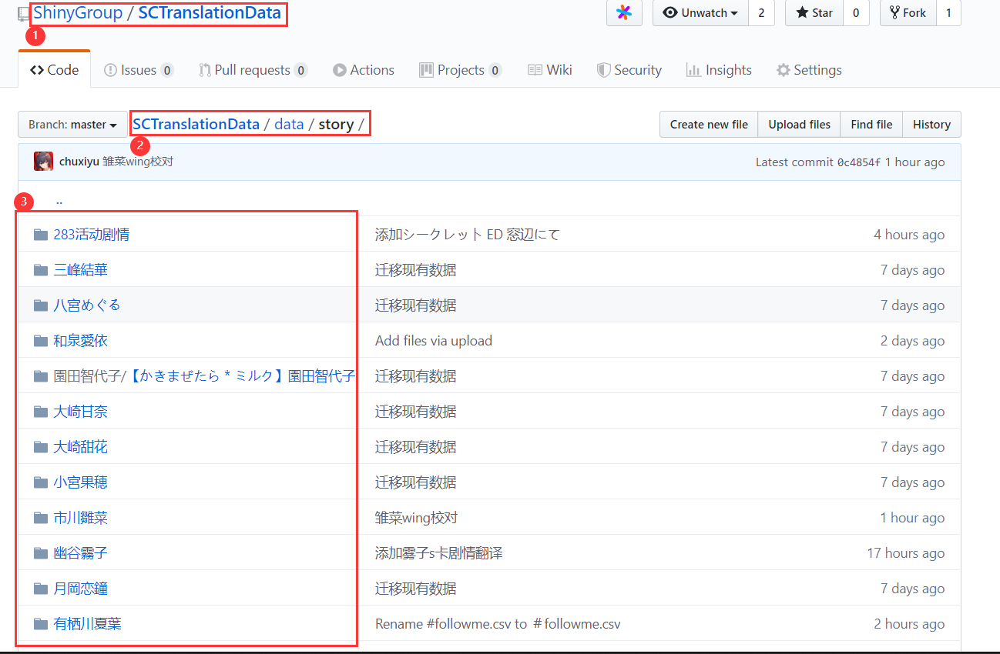
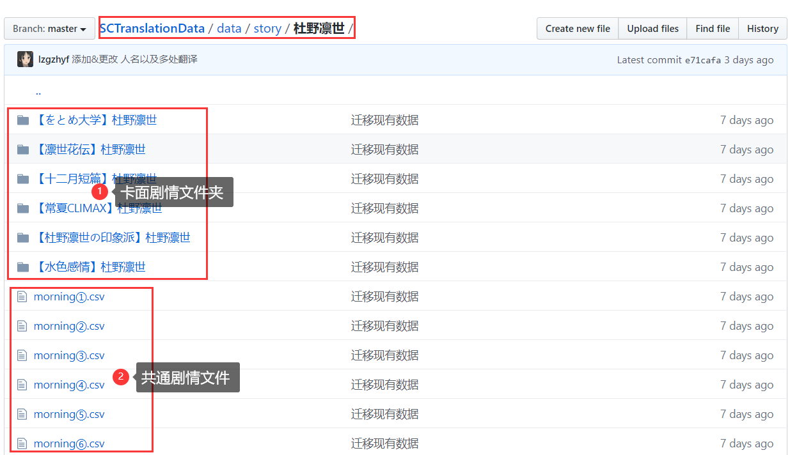
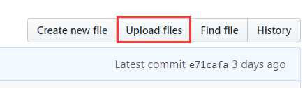
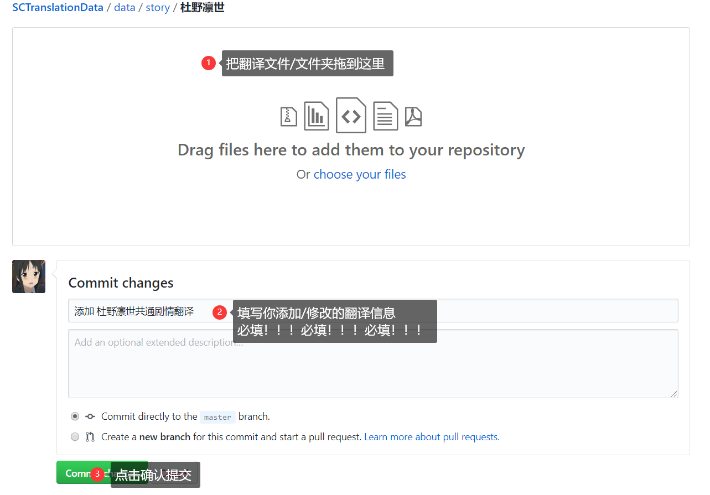
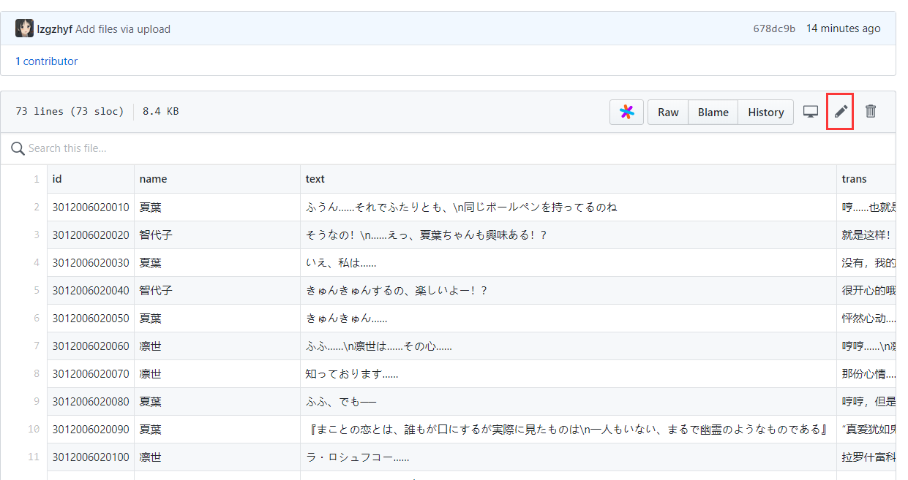
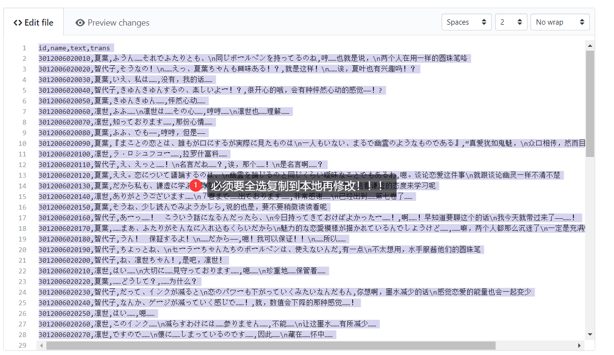
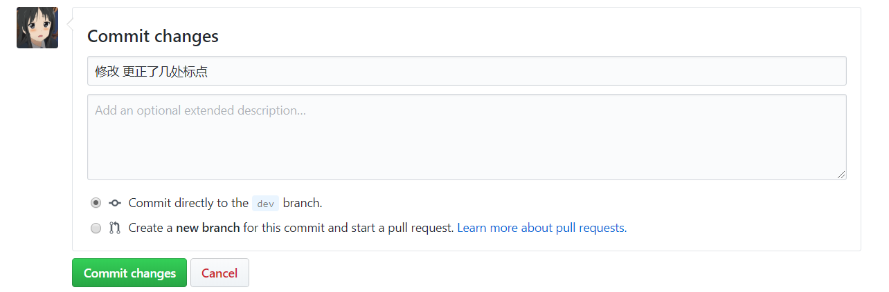

# GitHub网页端使用流程

## 1. 进入项目界面

（上传之前，请确认自己已经加入GitHub群组。）

[点击该链接](https://github.com/ShinyGroup/SCTranslationData/tree/master/data/story)直接进入剧情存放位置。

也可以在项目主页，进入data/story文件夹。

图中的③部分就是各个角色和活动剧情的文件夹。

## 2. 进入角色剧情文件夹

以杜野凛世为例，我们可以看到

①是卡面剧情文件夹。每张卡以“【卡名】角色名”建立单独文件夹。卡名可以参照[角色剧情表](https://docs.qq.com/sheet/DZmxQUkJXWVV3VWpp)，需要自己建立。

②是共通剧情文件。共通剧情是直接放在角色根目录下的。

## 3. 上传文件

点击右上角的【Upload files】

之后操作步骤如下图所示↓↓↓

①拖放文件的话，可以拖放单个csv文件（比如共通剧情、已有卡面/活动里面的单个剧情），也可以拖放一整个文件夹（比如一整个翻译好的“【卡名】角色名”文件夹，或一整个【活动名】文件夹）。

请等文件上传进度条走完，再下一步。

②请务必填写你所做的修改的概括信息。

> 关于commit的信息如何填写
>
> 第一栏是必填的，简略写你添加、修改、删除了什么
>
> 当一次性修改很多文件时，只需要填写最重要的改动，并简略概括
>
> 例如：添加 巡、灯织的剧情翻译
>
> 如果改动不多，那么建议写上具体卡名、活动名
>
> 例如：- 添加 【ゆらゆらアクアリウム】大崎甘奈翻译
>
> 下方的详细描述可以不写，如果你对本次提交有特别说明可以写
>
> 例如：修改 千雪剧情内的所有翻译中的语气词假名，改用中文翻译

③点击提交后，如果没有意外，你的剧情就上传成功了。

## 4. 修改文件

如果你发现翻译文件有需要修改的地方，就点击你要修改的文件。

点击红框的笔，进入编辑模式。

如果你只是修改个别字词、几处标点等简单修改的话，直接在该网页进行修改提交即可。

如果你要进行大幅修改，那么先选中全部文本，复制粘贴到本地文件中，对这个文件进行修改后，再粘贴到网页里，提交修改。

> 这里你可能要问，为什么修改要先复制网页上的到本地呢？
>
> 如果我本地有之前的文件，直接拿旧的文件修改，然后直接粘贴到网页里不可以吗？
>
> 答案是有风险，强力不建议这么做！
>
> 因为你在上传这个翻译文件之后，这个翻译有可能经过别人的校对或者修改了。
>
> 此时你本地旧的文件还是处于没有修改的状态，如果你在旧文件上修改，然后直接粘贴到网页上，那其他人改过的地方就**全 部 被 你 覆 盖 掉 了！**
>
> 所以，除非你一定确定以及肯定该文件上传后没有被别人修改过，就可以不用复制网页上的。
>
> 否则，任何修改文件的操作，都必须先复制网页上的最新版本到本地，修改完再贴回网页！

修改完后，同样是填写修改信息、点击提交，和上传是一样的。