# 翻译流程

## 1. 占坑

首先在腾讯共享文档里，确认要翻译的剧情是否有人占坑。

腾讯文档-全部文档-与我共享，或直接点击下方链接使用网页版。

[角色剧情表](https://docs.qq.com/sheet/DZmxQUkJXWVV3VWpp)

[活动剧情表](https://docs.qq.com/sheet/DZkJMa3hqR1VqdEZO)

​            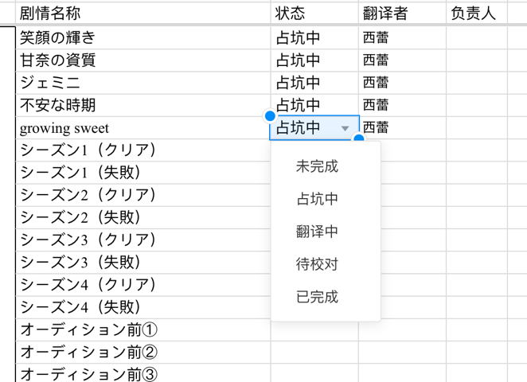            

确认无人占坑后，把要翻译的剧情的状态一栏改为“占坑中”，并在翻译者处填入翻译者名字。

如果上传的文本不是你翻译的，请在**负责人**一栏写你的名字。

## 2. 安装翻译插件

一共需要安装两个插件。

首先安装油猴插件（推荐Chrome浏览器）。

​            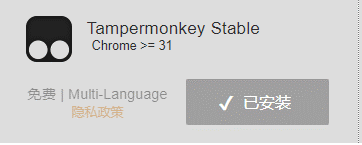            

[油猴插件安装地址](https://www.tampermonkey.net)

确认油猴安装好后，再安装翻译插件。

[翻译插件安装地址](https://shiny.fun/ShinyColors.user.js)

全部安装完成后，进入游戏，确认插件是否开启。

​            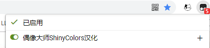            

## 3. 提取剧情文本

打开**相册部分**，选择要翻译的偶像和剧情（这里以恋钟的共通剧情一歩先へ为例）。

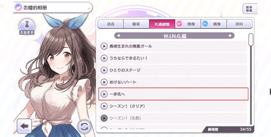

进入后的地址栏如下所示

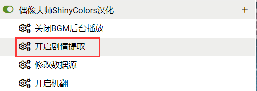

为了提取剧情的csv文本，我们需要在地址栏后加后缀。

```http
#story=edit
```

加完后应该是如下这个样子的。

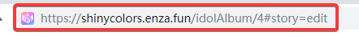

变更完成后，按下`Enter回车键`，页面会重载。

刷新完成后，进入剧情内可以看见页面右边出现的“剧情”图标。


将鼠标移动到图标上，会出现如下选项。

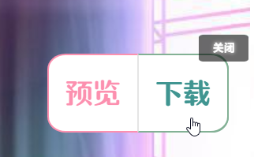

这里我们选择“下载”，用来提取CSV文本。

下载完成后得到的CSV文件就是我们用于填充翻译的文本了


## 4. 安装唯一指定推荐翻译编辑器

下载Visual Studio Code（下称：vscode）。

[vscode下载地址](https://code.visualstudio.com/)

安装后打开大概是这样子的，软件默认英文，我们需要安装两个插件。

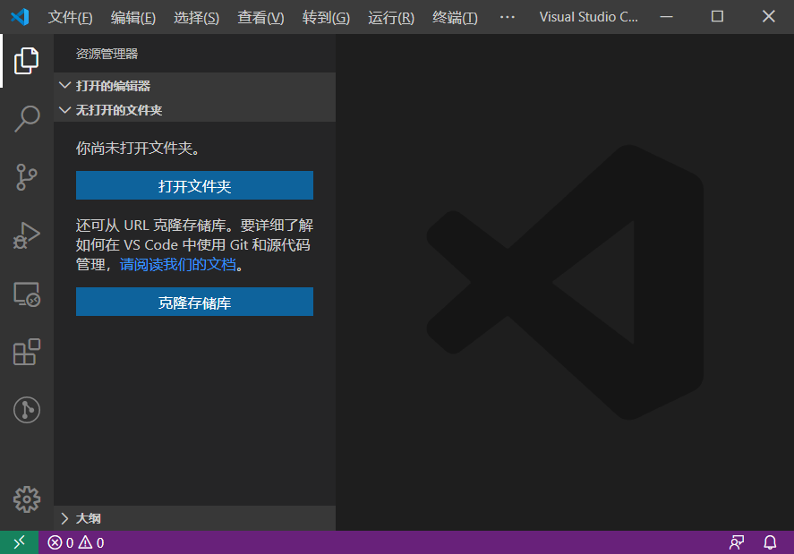

### 1. vscode汉化插件（Chinese (Simplified) Language Pack for Visual Studio Code）


安装完成后可能需要重启软件，以后编辑器就是中文了。

### 2. CSV辅助插件（Rainbow CSV）


## 5. 开始翻译吧

打开我们刚刚下载的剧情csv文件，打开之后大概是这样的。

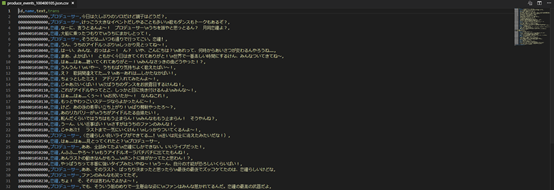

**白字**是文本编号，**禁止修改！**

**蓝字**是说话者，**参考用，禁止修改！**

**黄字**是句子原文，**参考用，禁止修改！**

要翻译的话就在黄字的逗号后面写上本句的翻译。


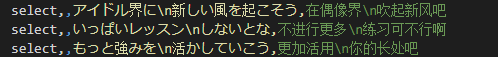

**绿字**就是我们的填写的翻译了

**↓↓↓必读！！！翻译文件的格式和规范请详细阅读下方链接的文件↓↓↓**

[翻译格式和规范](翻译格式和规范.md)

**↑↑↑必读！！！翻译文件的格式和规范请详细阅读上方链接的文件↑↑↑**

## 6. 收尾工作

如果你已经翻译完了，请把名字写在csv文件的译者逗号后面一栏

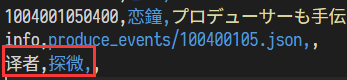

info那一行不要动。

翻译者的名字如图所示，请不要写到其他栏位上。

如果名字显示是**蓝色**的那就对了。

**名字如果是白色、黄色或者绿色，都是没填对地方**

最后，我们得到的翻译文件的名字应该是：

剧情名.csv，例如


但插件有时可能抽风，并不能正常地命名好文件：

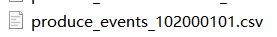

这时候，你可以对照着[角色剧情表](https://docs.qq.com/sheet/DZmxQUkJXWVV3VWpp)和[活动剧情表](https://docs.qq.com/sheet/DZkJMa3hqR1VqdEZO)里面的剧情名字进行手动修改成 *剧情名.csv*。

到此，翻译文件就填写完成了。

## 7. 预览翻译

当需要检查翻译在游戏中的表现时，可以在本地直接检查。

回到游戏内，点击插件图标的“预览”。

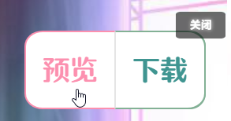

此时会弹出文件选择器，将刚刚翻译好的CSV文件选择上传。

上传完毕后，会提示成功。

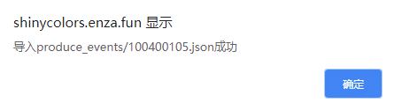

此时重新进入该剧情就可以看到效果了。


如果有需要改动的地方，再修改CSV文件，再上传预览，直到满意为止。

## 8. 上传翻译

翻译文本和自我校验结束之后，就可以上传翻译了。

下面将教你如何使用GitHub上传翻译，如果你实在学不会，那就求助群里有空的大佬，让他们帮你上传吧。

- 要使用GitHub，首先需要注册GitHub账号，注册过程这里不赘述 。

- 注册完毕后，首先加入本项目的群组（也可以让管理邀请）[点我查看群组](https://github.com/ShinyGroup)，**不加入群组是无法上传的！！！**

- 加入群组之后，点击[SCTranslationData](https://github.com/ShinyGroup/SCTranslationData)项目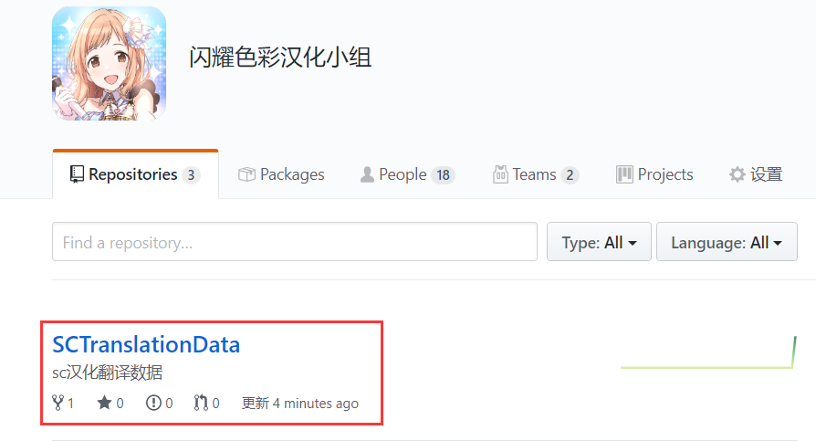

- 此时我们就进入了该页面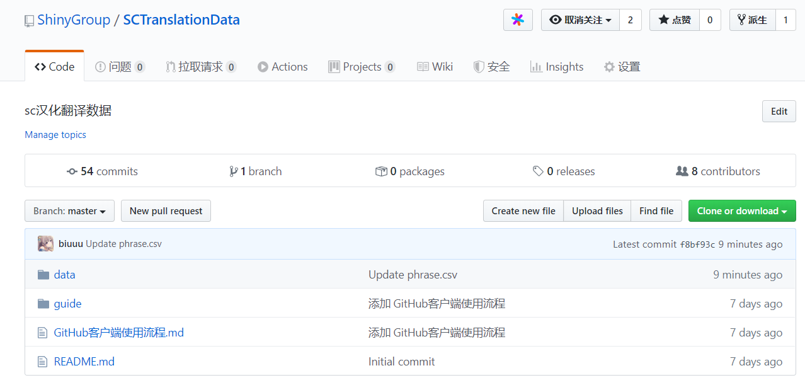

现在，如果你想上传，有四种选择：

1. 会Git，可以直接开始提交，不用多说。

2. 学习[GitHub网页端使用流程](GitHub网页端使用流程.md)，难度★★☆☆☆
3. 学习[GitHub客户端使用流程](GitHub客户端使用流程.md)，难度★★★☆☆
4. ~~学习vscode的Git使用流程~~（挖坑）